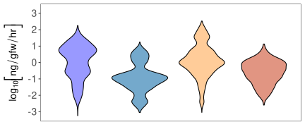
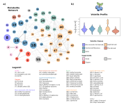
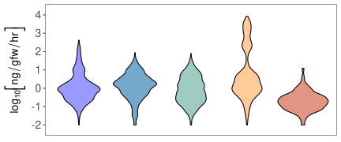
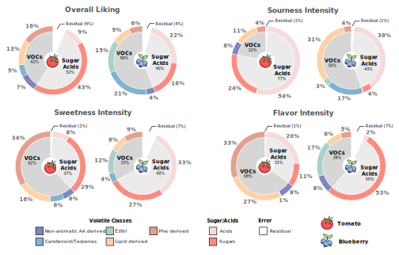
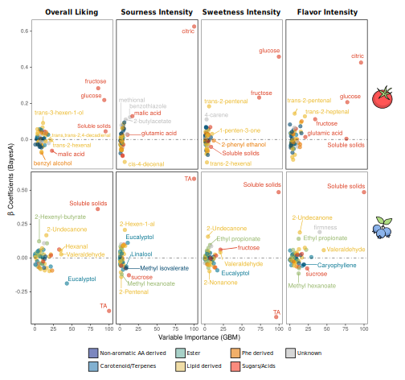
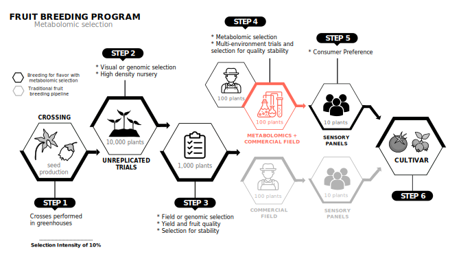

# Welcome to Metabolomic Selection for Enhanced Fruit Flavor

This repository contains data and scripts used to repoduce analyses in the manuscript "Metabolomic Selection for Enhanced Fruit Flavor" found on [BioRxiv](https://www.biorxiv.org/content/10.1101/2020.09.17.302802v1.full)

# Table of Contents
1. [Abstract](#abstract)
2. [Figures](#figures)

# Abstract 

# Figures 

Here we will go through the figures and which scripts were used to generate the underlying analysis. Often we generate the analysis in one script and design the figure component in another. We then combine the figure components together in inkscape.

## Figure 1 

To generate this figure, we start by preprocessing the data from the supplemental files with default choices for imputation and scaling:

* [0.preprocessing.R]   

Next we create the metabolite network using the WGCNA package:

* [1.a.wgcna_tomato.R]  

Then we plot the tomato volatile concentration violin plots in panel b:

* [1.b.metabolite_histograms.R]

Additionally, the cytoscape visualization used to plot out the results from 1.a.wgcna_tomato.R and 2.a.wgcna_blueberry.R. Also used to compute betweenness centrality statistics:

* [./results/fig1/asPublished_metabolite_networks.cys]

## Figure 2 

### Creating the blueberry metabolite network:

* [2.a.wgcna_blueberry.R]

### Plotting the blueberry volatile concentration violin plots in panel b:

* [2.b.metabolite_histograms.R]

The blueberry cytoscape visualizations are included in the cytoscape network file above.

## Figure 3 

### Calculating contributions of volatile classes to variance in flavor ratings using linear mixed modeling:

* [3.a.variance_decomposition.R]  

## Figure 4 

### A) Training metabolomic selection models

* [4.a.1.metabolomic_selection_tomato.R]

### B) Comparing genomic selection and metabolomic selection models

These models were ran on our HiPerGator cluster. The general structure is the first bash script launches the jobs for cross validation and replication, the second bash script creates an environment to run the jobs in R, and the R script does the computation.

* [4.b.1.genomic_selection_tomato.sh]

* [4.b.2.genomic_selection_tomato.sh]

* [4.b.3.genomic_selection_tomato.R]

* [4.b.4.metabolomic_selection_tomato.sh]

* [4.b.5.metabolomic_selection_tomato.sh]

* [4.b.6.metabolomic_selection_tomato.R]

* [4.b.7.gblup_plots.R]

### C) Evaluating how many fruit varieties are needed to train accurate metabolomic selection models

* [4.c.1.subsampling.sh]

* [4.c.2.subsampling.sh]

* [4.c.3.subsampling.R]

* [4.c.4.subsamplingPlots.R]

## Figure 5 

### Using models trained on all varieties to calculate weights for inference

* [5.a.1.calculate_final_weights.Rmd]

* [5.a.2.plot_tomato_weights.R]

* [5.a.3.plot_blueberry_weights.R]

## Figure 6 

